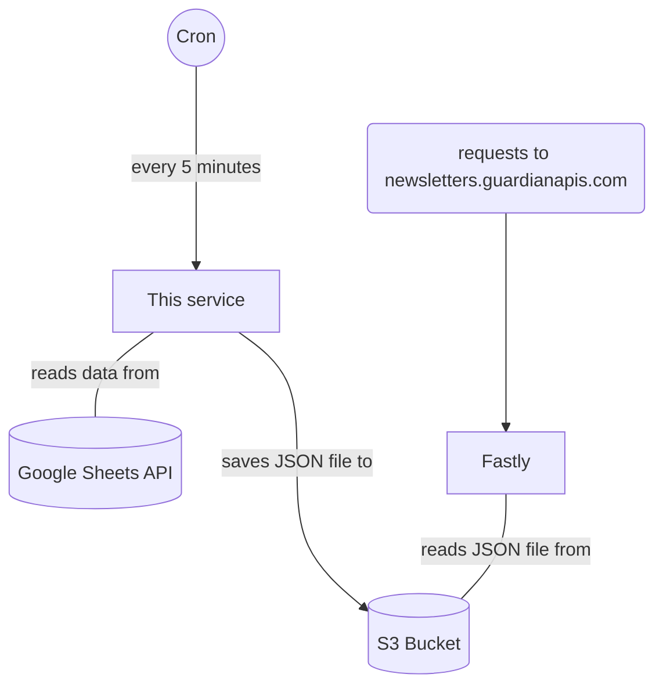

# DEPRECATED - Newsletter data is now manage by  the [Newsletters-NX project](https://github.com/guardian/newsletters-nx)

# Newsletters

This is the Newsletters service. The service is an AWS scheduled lambda, that runs every 5 minutes and:
1. reads newsletter data from the Google spreadsheet (you can find the CODE version here: https://docs.google.com/spreadsheets/d/1_eN5NTcWOUyLLLKUJmrGZMlz1l4Zt4taTUFxD-2Bl_k/edit#gid=0)
2. validates this data and uploads it to an S3 bucket

The s3 bucket is cached by fastly on CODE and PROD. The urls are:

* [CODE](https://newsletters.code.dev-guardianapis.com/newsletters)
* [PROD](https://newsletters.guardianapis.com/newsletters)
* [DEVELOPMENT](https://aws-frontend-newsletters-source.s3.eu-west-1.amazonaws.com/DEVELOPMENT/newsletters)

## Setting up your development environment

* Configuration is fetched from AWS Parameter Store. You will need Frontend credentials from Janus.
* `yarn install` to install the dependencies
* `yarn dev` to run the job
* `yarn test` to run the tests
* `yarn preview` to generate a local JSON file in the `/preview` folder, using the `/preview/sampleData.csv`
* `yarn preview-code-data` to generate a local JSON file in the `/preview` folder, using data from CODE

Running the application locally uses the DEVELOPMENT stage.

## Configuration

Stored is AWS Systems Manager > Parameter Store, under path: `/${STAGE}/newsletters/newsletters-source/${key}`

* `spreadsheet.id`
* `google.key`

## Architecture

## API Documentation

Please ensure the [open-api-spec](./open-api.yaml) is updated with all relevant changes

## Core technologies included

* TypeScript
* Node
* Jest (testing library)

## [Changelog](./CHANGELOG.md)
