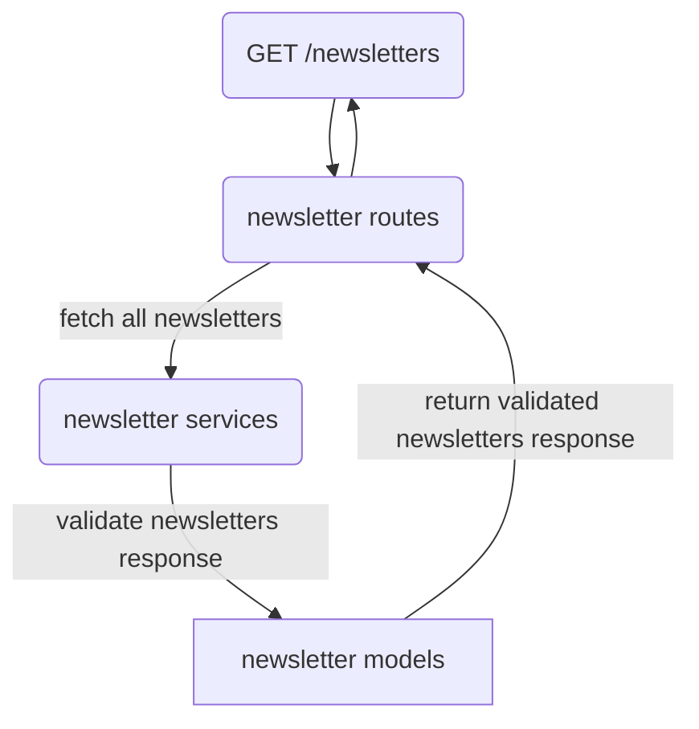

# Newsletters API V1

This brings the newsletters data into an actual API (unlike a regular copy from a Google sheet to S3 as it was previously).

This project implements a [fastify](https://www.fastify.io/) server, using [pino](https://getpino.io/#/) logging. [Pino-pretty](https://github.com/pinojs/pino-pretty) is used to improve logging in local development but should not be used in production environments. It is marked as a dev dependency in this project but should only ever be used to pipe logging outputs to.

## Directory structure

Example diagram using the `GET /newsletters` endpoint to illustrate directory structure split

